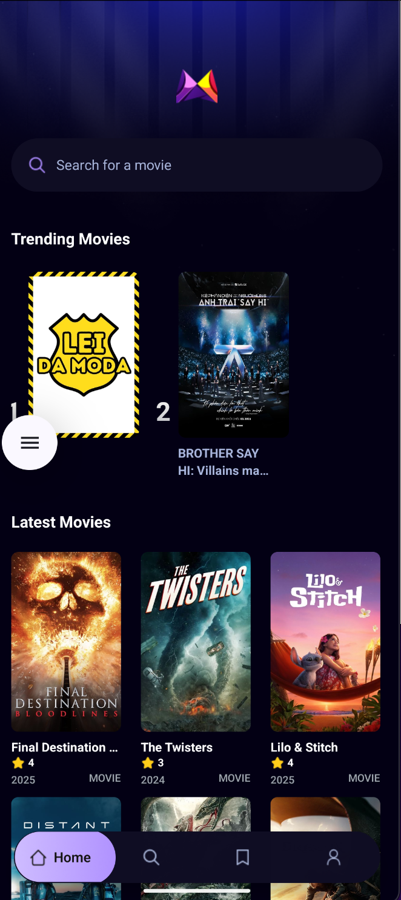
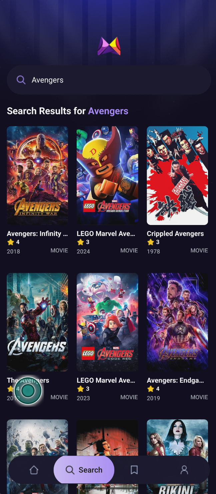

# 🎬 MovieBot

MovieBot is a modern, visually appealing movie discovery app built with Expo and React Native. Instantly search, browse trending films, and view detailed movie info with a beautiful, intuitive UI.

## ✨ Features

- 🔍 Instant movie search with live results
- 🏠 Trending movies on the home page
- 📄 Detailed movie information
- 💾 Save your favorite movies
- Responsive, mobile-first design

## 📱 App Screenshots

<p align="center">
   
   
    
</p>


## 🚀 Getting Started

1. **Install dependencies**

   ```bash
   npm install
   ```

2. **Start the app**
   ```bash
   npx expo start
   ```

Open in your preferred simulator or Expo Go.

## 🛠️ Tech Stack

- React Native (Expo)
- TypeScript
- Tailwind CSS (NativeWind)
- Appwrite (for backend services)
- TMDB API (for movie data)

## 🌟 Why MovieBot?

- Clean, modern UI
- Fast, debounced search
- Real-time trending updates
- Easy to extend and customize

---

Feel free to add your own improvements or contact me for collaboration!
